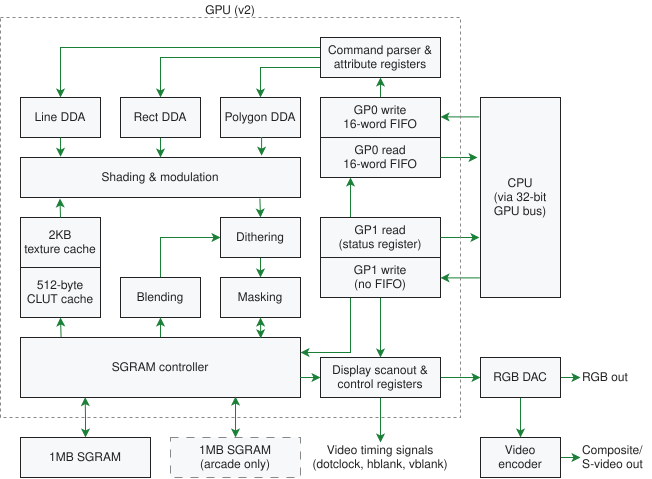
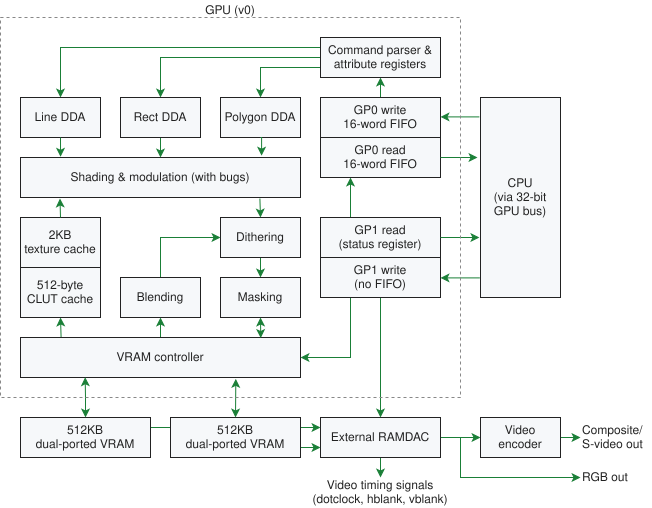

#   Graphics Processing Unit (GPU)
The GPU can render Polygons, Lines, or Rectangles to the Drawing Buffer, and
sends the Display Buffer to the Television Set. Polygons are useful for 3D
graphics (or rotated/scaled 2D graphics), Rectangles are useful for 2D graphics
and Text output. 

The v0 GPU has the same pipeline, but drives dual-ported VRAM and an external
RAMDAC instead of SGRAM: 

[I/O Ports, DMA Channels, Commands, VRAM](i-o-ports-dma-channels-commands-vram.md#io-ports-dma-channels-commands-vram) 
[Render Polygon Commands](render-polygon-commands.md#render-polygon-commands) 
[Render Line Commands](render-line-commands.md#render-line-commands) 
[Render Rectangle Commands](render-rectangle-commands.md#render-rectangle-commands) 
[Rendering Attributes](rendering-attributes.md#rendering-attributes) 
[Memory Transfer Commands](memory-transfer-commands.md#memory-transfer-commands) 
[Other Commands](other-commands.md#other-commands) 
[Display Control Commands (GP1)](display-control-commands-gp1.md#display-control-commands-gp1) 
[Status Register](status-register.md#status-register) 
[Versions](versions.md#versions) 
[Depth Ordering](depth-ordering.md#depth-ordering) 
[Video Memory (VRAM)](video-memory-vram.md#video-memory-vram) 
[Texture Caching](texture-caching.md#texture-caching) 
[Timings](timings.md#timings) 
[GPU (MISC)](misc.md#gpu-misc) 
