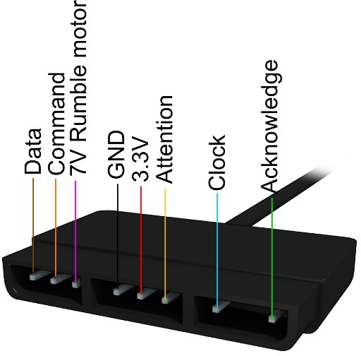

#   Controller Ports and Memory-Card Ports
#### Controller Ports and Memory-Card Ports


```
                   _______________________
Memory card slot: | 9 7 6 | 5 4 3 |  2 1  |
                  |_=_=_=_|_=_=_=_|__=_=__|
                   _______________________
                  | 9 8 7 | 6 5 4 | 3 2 1 |
Controller port:  | * * * | * * * | * * * |
                  '\______|_______|______/'
```

| Pin | Dir | Name         | SIO0 pin | Description                    |
| --: | :-- | :----------- | :------- | :----------------------------- |
|   1 | In  | `DAT`/`MISO` | `RX`     | Serial data from device        |
|   2 | Out | `CMD`/`MOSI` | `TX`     | Serial data to device          |
|   3 |     | `+7.5V`      |          | Supply for rumble motors       |
|   4 |     | `GND`        |          | Ground                         |
|   5 |     | `+3.5V`      |          | Supply for main logic          |
|   6 | Out | `/CSn`       | `DTRn`   | Port select                    |
|   7 | Out | `SCK`        | `SCK`    | Serial data clock              |
|   8 | In  | `/IRQ`       | `/IRQ10` | Lightgun IRQ (controller only) |
|   9 | In  | `/ACK`       | `DSR`    | Data acknowledge IRQ           |

/CSn are two separate signals (/CS1 for controller/memory card port 1, /CS2 for
port 2). All other signals are exactly the same on all four connectors (with the
memory card slots lacking the /IRQ pin and shield).<br/>

#### /IRQ pin
Most or all controllers leave pin 8 unused, the pin can be used as lightpen
input (not sure if the CPU is automatically latching a timer somewhere?), if
there's no auto-latched timer, then the interrupt would be required to be
handled as soon as possible; ie. don't disable interrupts, and don't "halt" the
CPU for longer periods (as far as I understood, the GTE can halt the CPU when
trying to read results of incomplete operations; to avoid that, one could wait
by software, eg. inserting NOPs, before reading GTE results...?)<br/>
(Some (or maybe all?) existing psx lightguns are reportedly connected to the
Video output on the Multiout port for determining the current cathode ray
position though).<br/>
