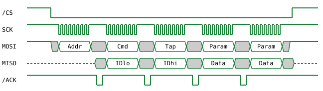
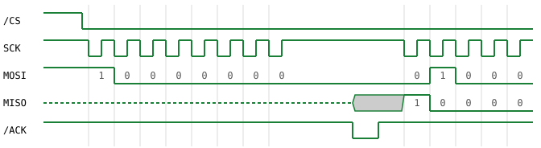

#   Controller and Memory Card Signals
#### Overview

Dashed lines are high impedance, grey areas are don't care.

#### Address byte (01h) being sent

The address byte, followed by the first bits of the command byte (42h) and of
the controller's reply (41h).

The vertical lines mark the falling clock edges.

Notes:

- All bytes are sent LSB first.
- The standard baud rate used by the kernel is ~250 kHz. Some controllers and
  memory cards may work with faster rates, but others will not.
- The clock polarity is high-when-idle (sometimes referred to as CPOL=1). Each
  bit is output on a falling clock edge and sampled by the other end on the
  rising clock edge that follows it (CPHA=1).
- The device has to pull /ACK low for at least 2 µs to request the host to
  transfer another byte. Once the last byte of the packet is transferred, the
  device shall no longer pulse /ACK.
- The kernel's controller driver will time out if /ACK is not pulled low by the
  device within 100 µs from the last SCK pulse. It will also ignore /ACK pulses
  sent within the first 2-3 µs (100 cycles) of the last SCK pulse.
- Devices should not respond immediately when /CS is asserted, but should wait
  for the address byte to be sent and only send an /ACK pulse back and start
  replying with data if the address matches.
